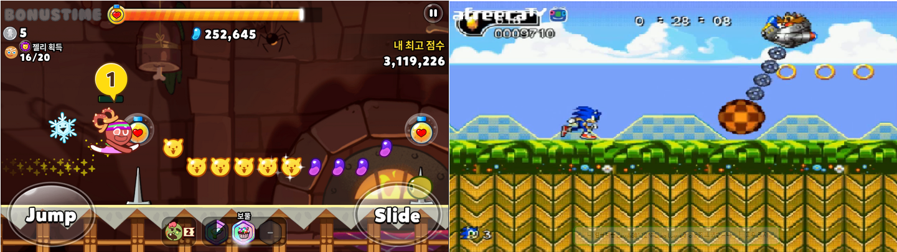
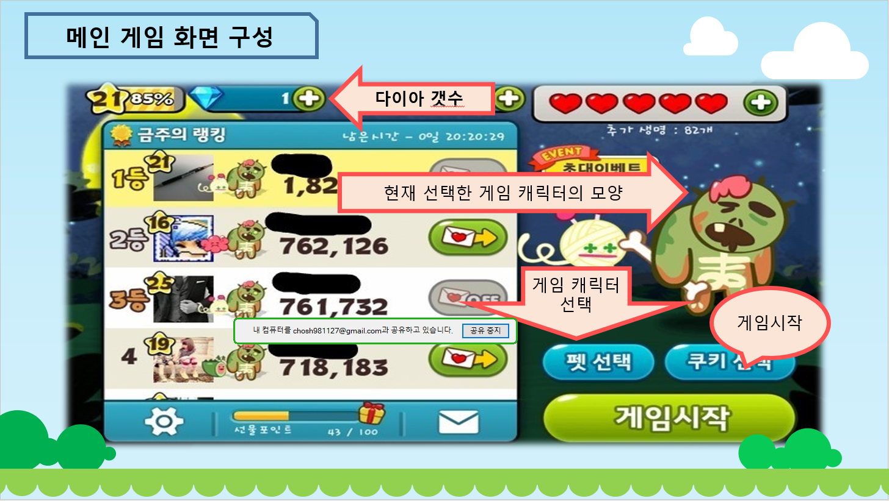
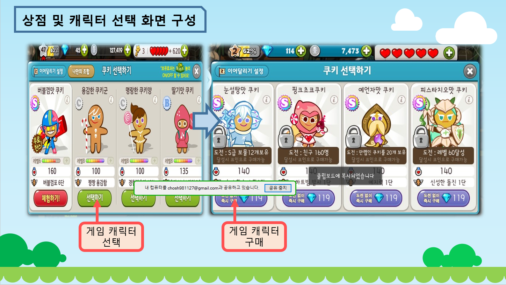
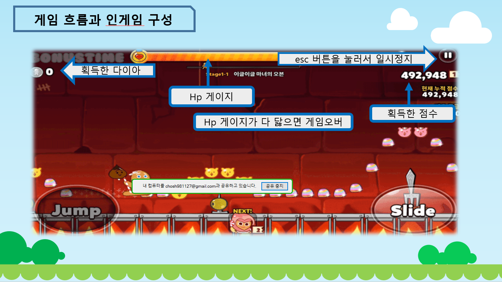
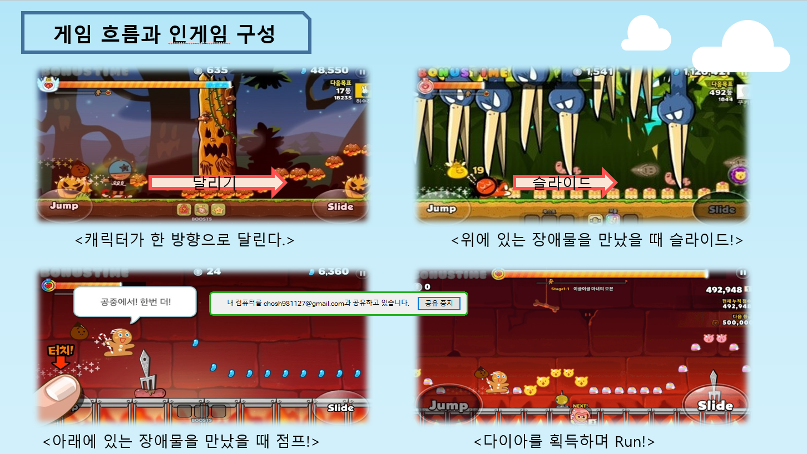
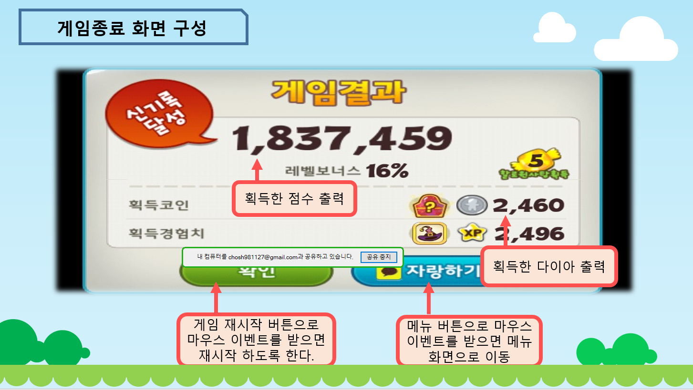
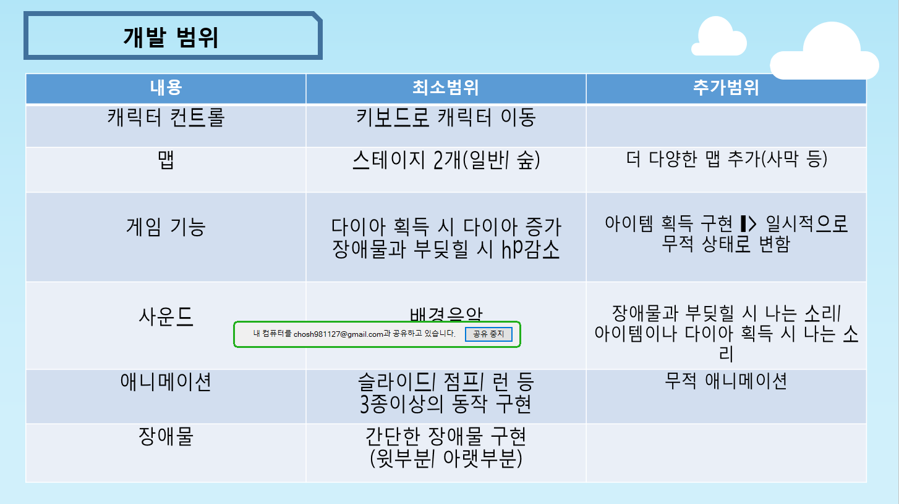

# 2DGP
2D Game Programming Project - final project

### 1. 게임의 소개
* ###### 제목: Cat-cher
* ###### copy 게임: 쿠키런
쿠키런과 소닉은 런게임이다. 두 게임 모두 장애물을 피하여, 정해진 루트로 달려가는 게임이다. 
쿠키런은 쿠키 캐릭터가 정해진 루트로 달려가며 젤리를 획득하고, 때로는 코인을 얻기도 한다. 그리고 모은 돈으로 게임의 메뉴에서 다른 쿠키를 사기도 하고, 체력이나 시간등을 업그레이드 할 수 있다. 소닉 게임은 장애물을 피하거나 몬스터를 죽이고 코인을 획득하고 루트를 통해 달려나가는 게임이다. 

* ###### 게임에 대한 설명
대표적인 특성으로 말하자면 런게임이다. 고양이가 어떤 무언가로부터 도망간다는 의미에서 cat-cher라는 제목을 지었다. 앞에 있는 장애물을 피한다.

### 2. GameState(Scene)의 수 및 각각의 이름
###### - gamestate의 수: 5
###### - gamestate들의 이름: 초기화면, 메뉴화면, 상점 및 캐릭터 선택, 인게임, 게임 종료후 게임결과화면       

### 3. 각 GameState별 다음 항목
* #### 초기화면
  * ###### 설명: 게임에 들어갈 때 나타나는 초기화면이다. 
  * ###### 객체들의 목록: 전체이미지, 게임 메뉴화면으로 들어가는 것 안내글
  * ###### 처리할 키나 마우스 이벤트: enter키
  * ###### enter를 누르면 메뉴화면으로 넘어가도록 한다.
* #### 메뉴화면
  * ###### 설명: 게임을 스타트할 건지, 상점 및 캐릭터 선택 화면으로 넘어갈 건지 선택할 수 있는 화면이다.
  * ###### 객체들의 목록: 현재 선택되어 있는 캐릭터의 모양, 스타트 버튼, 메뉴버튼, 기본 배경
  * ###### 처리할 키/마우스 이벤트: 마우스 이벤트 
  * ###### 해당 버튼을 누르면 그에 해당하는 다음 화면(gamescene)으로 넘어갈 수 있게 한다. 
* #### 상점 및 캐릭터 선택
  * ###### 설명: 모은 돈으로 캐릭터를 선택할 수 있는 상점으로써 모아놓은 캐릭터는 무료로 선택할 수 있는 화면이다.
  * ###### 객체들의 목록: 양옆으로 넘길 수 있는 화살표 2개(좌우), 고양이 캐릭터, 아래의 선택 혹은 구매 버튼, 메뉴버튼
  * ###### 처리할 키/마우스 이벤트: 마우스 이벤트, 키보드 이벤트
  * ###### 구매버튼을 누르면 구매할 수 있도록, 선택 버튼을 누르면 캐릭터 선택이 가능하도록
    ###### 좌우키보드를 누르면 좌우로 캐릭터 전환이 가능하도록
* #### 인게임
  * ###### 설명: 게임의 플레이가 이루어지는 화면
  * ###### 객체들의 목록: 기본배경, 장애물, 캐릭터, 코인
  * ###### 처리할 키/마우스 이벤트: 마우스 이벤트, 키보드 이벤트
  * ###### 'w', 'a', 's', 'd'를 눌러서 좌우 움직임, 슬라이드, 점프가 가능하도록 한다. 
    ###### 스페이스 버튼을 눌르면 높은 점프를 한다. 
    ###### esc버튼을 누르면 게임을 일시정지 하도록 한다.
* #### 게임 종료
  * ###### 설명: 인게임이 종료된 후 결과가 나오는 화면
  * ###### 객체들의 목록: 리스타트버튼, 메뉴로 나가는 버튼, 점수출력란, 획득한 
  * ###### 처리할 키/마우스 이벤트: 마우스 이벤트
  * ###### 리스타트 버튼을 누르면 게임을 다시시작, 메뉴 버튼을 누르면 메뉴화면으로, 인게이에서 획득한 점수가 점수 출력란에 뜬다.       
  
  
  
  
### 4. 필요한 기술
###### - 언어라는 게 기본틀은 비슷한 거 같습니다. 클래스, 구조체, 함수작성 등의 기본적인 코드를 효율적으로 짤 수 있어야 합니다.
###### - 충돌처리를 할 수 있어야 합니다. 
###### - 윈도우 프로그래밍에서는 이미지 파일을 일일이 비트맵으로 불러와서 리소스 파일에 넣고 사용했는데 load_image를 통한 이미지            불러오기가 가능한 것과 같이, 기존 C++과는 조금 다르게 사용할 수 있는 부분들이 기대된다.

### 5. 게임 메인 화면

 * ###### 다이아 갯수
 * ###### 현재 선택한 게임 캐릭터의 모양
 * ###### 게임 캐릭터 선택 버튼
 * ###### 게임시작 버튼
 
 
### 6. 상점 및 캐릭터 선택 화면

 * ###### 게임 캐릭터 선택 버튼
 * ###### 게임 캐릭터 구매 버튼
 * ###### 캐릭터들 
 
 
### 7. 인게임 구성

 * ###### 획득한 다이아
 * ###### Hp 게이지
 * ###### esc버튼 - 일시정지
 * ###### 획득한 점수

### 8. 게임 흐름

 * ###### 캐릭터는 한 방향으로 달린다.
 * ###### 위에 있는 장애물을 만나면 슬라이드!
 * ###### 아래 있는 장애물 만나면 점프!
 * ###### 달리는 도중 다이아를 획득!
 * ###### 장애물이랑 부딪히면 Hp감소
 * ###### Hp가 다 닳으면 Game Over

### 9. 게임 종료 scene

 * ###### 획득한 점수 출력
 * ###### 획득한 다이아 출력
 * ###### 게임 재시작 버튼 - 게임 재시작
 * ###### 메뉴 버튼 - 메뉴화면으로 이동
 

### 10. 개발 범위

내용 | 최소범위 | 추가범위 
----- | ----- | -----
캐릭터 컨트롤 | 키보드로 캐릭터 이동 | 
맵 | 스테이지 2개(일반/숲) | 더 양한 맵 추가(사막 등)
게임 기능 | 다이아 획득 시 다이아 증가, 장애물과 부딪힐시 Hp 감소 | 아이템 획득 구현-> 일시적으로 무적 상태로 변함
사운드 | 배경음악 | 장애물과 부딪힐 시 나는 소리, 아이템이나 다이아 획득 시 나는 소리
애니메이션 | 슬라이드, 점프, 런 등 3종 이상의 동작 구현 | 무적 애니메이션
장애물 | 간단한 장애물 구현(윗부분/아랫부분) | 

### 11. 개발 계획

1주차 | 리소스 수집 | 게임 내 필요한 리소스 수집
----- | ----- | -----
2주차 | 게임 내 오브젝트 | 맵과 장애물 배치
3주차 | 마우스 및 키보드 동작 | 캐릭터 컨트롤 기능, 게임 내 메뉴 클릭에 대한 처리
4주차 | 충돌거리 구현 | 장애물과 충돌 시 처리 구현(Hp)
5주차 | 시작과 종료, 메뉴 화면 처리 | 게임 시작과 종료 및 메뉴 화면
6주차 | 캐릭터 선택 구현 | 상점에 대한 부분 처리
7주차 | 밸런스 조절 및 사운드 추가 | 게임 내 밸런스 조절과 사운드 추가
8주차 | 마무리 | 최종 점검 및 릴리즈
 
